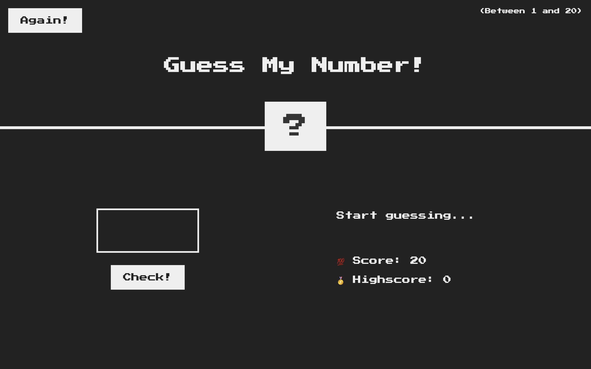

<h1 align="center">🤔 Guess My Number 🤷</h1>

  
  

Click [here](https://guessmynumber-rajeev.netlify.app/) to play the game.

## How to play the game?

- Enter the number in the input field between 1 to 20.
- Click on the `Check` button below the Input field.
- If the number is correct, you win the game.
- If the number is not correct, you will loose one score.
- You have 20 chances to guess the number.
- If you loose all the chances, you will loose the game.
- If you want to play again, click on the `Again` button.

## Tech stack

#### Frontend

- JavaScript
- CSS
- HTML
- Markdown
- DOM

#### Other Tools

- VS Code
- Prettier
- Netlify
- Git

## Points to remember while testing the WebApp

1. First of all fork this [Repository](https://github.com/beRajeevKumar/Guess-My-Number.git) and clone it.
2. Drag the project into VS Code.
3. Click to the [Live Server](https://marketplace.visualstudio.com/items?itemName=ritwickdey.LiveServer) extension and run the `index.html` file.
4. The app is now running, Now you can test the Website.

## Useful Links

- [Project Demo](https://guessmynumber-rajeev.netlify.app/) for Web Version.

- [Project Repository](https://github.com/beRajeevKumar/Guess-My-Number.git)

## Need help?

Feel free to contact me on [Twitter](https://twitter.com/be_rajeevkumar) or [LinkedIn](https://www.linkedin.com/in/berajeevkumar/), know more about me at my [Portfolio](https://iamrajeev.me).

<h1 align=center>Happy Coding 👨‍💻</h1>
